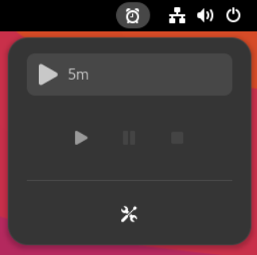
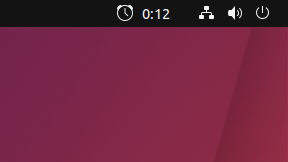

# Description:
Simple Timer is a Gnome Shell Extension that adds a Timer to the Panel.
It will send a notification and play a sound effect after the timer has run out.

You won't forget the oven again!

# Installation - Manual
After downloading the extension just run the install script:

```sh install.sh```

To enable the extension install and run gnome-tweaks, or go to the gnome extensions web page.
```sudo apt install gnome-tweaks```

```https://extensions.gnome.org/local```

# Sources:
Polite.wav Source:
https://github.com/akx/Notifications