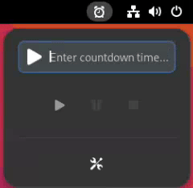

# Simple Timer - Gnome Extension


# Description:
**Simple Timer** is a GNOME Shell extension that adds a customizable countdown timer to your top panel.
When the timer ends, it notifies you with a visual alert and a customizable sound effect.

Perfect for reminders, productivity breaks, or - yes - not burning the pizza again.

# Usage:

There are two ways to enter the duration:

## Direct Numeric Input

You can simply type the time in. The format `hh:mm:ss` will be automatically added.

**Examples:**
- `5` -> `0:05`
- `112` -> `1:12`
- `53000` -> `5:30:00` 



## Detailed Time Specification

You can specify the duration using hours, minutes, and seconds (h, m, s). The order of these units is flexible and does not need to follow a specific sequence.

**Examples:**
- `5s` -> `0:05`
- `1m 12s` -> `1:12`
- `5h 30m` -> `5:30:00`
- `30m 5h` -> `5:30:00`
- `1m` -> `1:00`


# Installation
   
## Installation - Web
- Visit the [official GNOME Extensions page for Simple Timer](https://extensions.gnome.org/extension/5115/simple-timer/)
- Click on the "ON/OFF" switch to install the extension. If prompted, follow the instructions to enable the GNOME Shell integration.


## Installation - Manual
- After downloading the extension just run the install script:

   ```
   chmod +x install.sh
   ./install.sh
   ```

## Enable the Extension:

- To enable the extension install gnome-extensions-app and run gnome-extensions-app

   ```
   sudo dnf install gnome-extensions-app
   gnome-extensions-app
   ```

- Or open the gnome extension webpage and enable the extension from there:

   https://extensions.gnome.org/local


# Sources:
- Polite.wav 
   Source: https://github.com/akx/Notifications